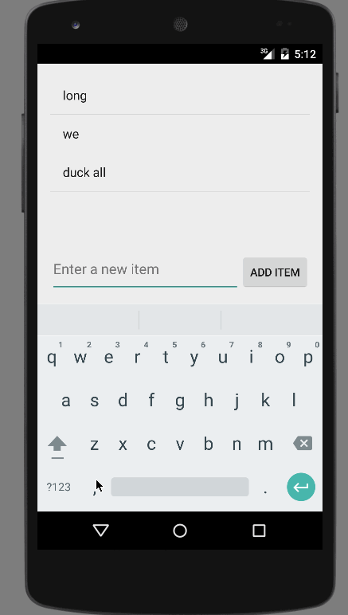

# Android Pre-work: Todo App Demo

(Sample of project submission README)

This is an Android demo application for displaying the Todo List. 
Currently the app can add, delete  and edit todo items from the list. 

Time spent: 7 hours spent in total

Quick checkout and run:
1) Clone this app as git clone.
2) Open Android Studio and do an import of this app.
3) on Menu Run > Run 'app'.
4) wait for ToDo app to come up or go to 'apps' and click 'Simple Todo' app to run it.

Quick manual notes of app usage:
1) Enter item in the input field (Enter a new item) and click 'Add Item' button To add item to list.
2) Click and hold on any item form the list to remove it from the list.
3) Click on an item to go to edit screen and once edited, click 'Save' button to save it back to the list.

Notes:

Animated gif walkthrough of this demo todo list app:

GIF created with [LiceCap](http://www.cockos.com/licecap/).
